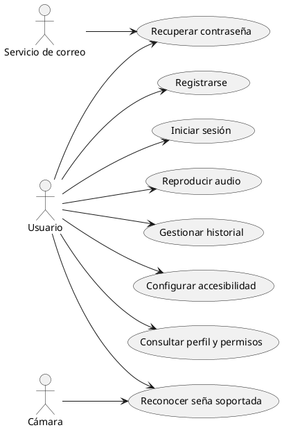

# Diagrama general de casos de uso

```plantuml
@startuml
left to right direction
actor Usuario
actor "Servicio de correo" as Mail
actor Cámara
Usuario --> (Registrarse)
Usuario --> (Iniciar sesión)
Usuario --> (Recuperar contraseña)
Mail --> (Recuperar contraseña)
Usuario --> (Reconocer seña soportada)
Cámara --> (Reconocer seña soportada)
Usuario --> (Reproducir audio)
Usuario --> (Gestionar historial)
Usuario --> (Configurar accesibilidad)
Usuario --> (Consultar perfil y permisos)
@enduml
```

El diagrama representa el alcance del SRS; no prueba integración operativa.
